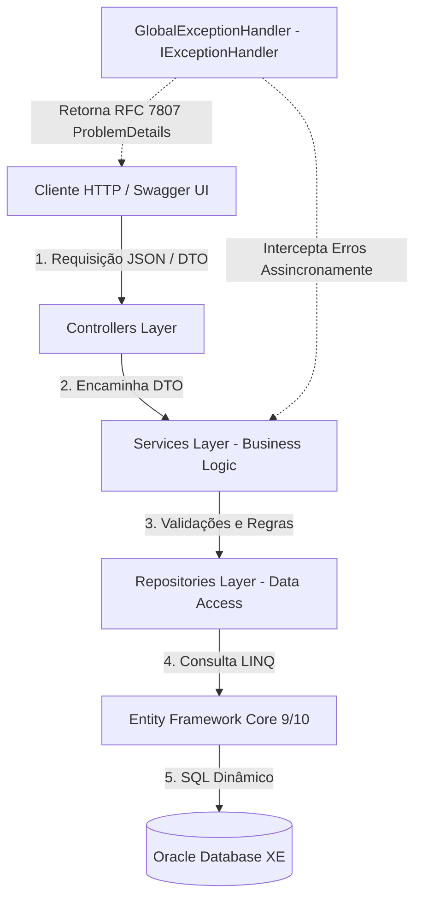

# 🐾 ClyvoVet API — Infraestrutura de Medicina Veterinária Digital

API RESTful empresarial de alto desempenho desenvolvida em **ASP.NET Core (.NET 10)** para a gestão da jornada contínua e preventiva de saúde de pets. Desenvolvido para o **FIAP Challenge 2026** em parceria com a **Clyvo VET**.

---

## 👥 Integrantes
* **Gabriel Garcia** — RM 563298
* **Andre Bellandi** — RM 564662
* **Vitor Augusto** — RM 564227

---

## 📋 Descrição do Negócio e do Desafio
A **ClyvoVet API** soluciona o problema da fragmentação e do cuidado meramente reativo na jornada de saúde animal. Tradicionalmente, os tutores só procuram auxílio em situações emergenciais agudas. 

Nossa plataforma atua como o **sistema operacional do cuidado contínuo**, unindo inteligência e dados longitudinais estruturados para clínicas parceiras e tutores. A arquitetura divide-se nos quatro grandes pilares do Challenge:
1. **Preventivo:** Vacinas e check-ups preventivos sob rígido controle.
2. **Terapêutico:** Agendamento e monitoramento de consultas clínicas.
3. **Bem-estar:** Histórico longitudinal de qualidade de vida do pet.
4. **Inteligência de Dados:** Integração limpa e barramento de dados preparado para automações (ex: alertas de vacinação via WhatsApp).

---

## 🏗️ Desenho de Arquitetura da Solução

O projeto adota os princípios da **Clean Architecture (Arquitetura Limpa)** e de baixo acoplamento (*Separation of Concerns*). Abaixo, o diagrama detalhado que demonstra o fluxo de controle e processamento de uma requisição na API:



### Detalhes das Camadas:
* **DTOs (Data Transfer Objects):** Classes dedicadas à transferência segura de dados nas fronteiras da API, com anotações de validação de modelo (`System.ComponentModel.DataAnnotations`) prevenindo estouro de limites ou formatos inválidos de dados (ex: e-mails incorretos).
* **Camada de Serviço (Service Layer):** Contém todas as regras de negócio da aplicação (ex: validação preventiva de e-mails duplicados, lógica de datas e períodos de consultas). Totalmente desacoplada do Entity Framework.
* **Camada de Repositório (Repository Layer):** Isola e encapsula o acesso direto ao contexto do EF Core (`AppDbContext`). Utiliza `.AsNoTracking()` em todas as leituras puras para otimização extrema de memória e tempo de processamento.
* **Global Error Handler (IExceptionHandler):** Middleware assíncrono moderno que intercepta erros globalmente na aplicação e padroniza as respostas de exceções no formato padrão de mercado **RFC 7807 (ProblemDetails)**, mapeando exceções semânticas de domínio diretamente para seus códigos HTTP adequados (`400 BadRequest`, `404 NotFound`, `500 InternalServerError`).
* **C# 12/13 Primary Constructors:** Todas as injeções de dependência de repositórios, serviços e controladores utilizam a sintaxe de construtores primários modernos, reduzindo código boilerplate e aumentando a legibilidade.

---

## 🔗 Rotas da API e Documentação

> **Base URL (local):** `http://localhost:5109`  
> **Base URL (Docker):** `http://localhost:8080`  
> **Scalar API Reference (UI):** `/scalar/v1`

---

### 👤 Donos (Tutores) — `/api/tutores`
> Tabela Oracle: `DONOS`

| Método | Rota | Descrição | Status HTTP |
|--------|------|-----------|-------------|
| `GET` | `/api/tutores?page=1&pageSize=10` | Lista todos os donos com paginação | `200 OK` |
| `GET` | `/api/tutores/{id}` | Busca dono por ID com lista de pets | `200 OK`, `404` |
| `GET` | `/api/tutores/email/{email}` | Busca dono por e-mail | `200 OK`, `404` |
| `GET` | `/api/tutores/{id}/pets` | Lista os pets do dono | `200 OK`, `404` |
| `POST` | `/api/tutores` | Cadastra novo dono | `201 Created`, `400` |
| `PUT` | `/api/tutores/{id}` | Atualiza dados do dono | `200 OK`, `400`, `404` |
| `DELETE` | `/api/tutores/{id}` | Remove dono | `204 NoContent`, `404` |

**Body POST/PUT:**
```json
{ "nome": "João Silva", "email": "joao@email.com", "telefone": "11999999999" }
```

---

### 🐾 Pets — `/api/pets`
> Tabela Oracle: `PETS`

| Método | Rota | Descrição | Status HTTP |
|--------|------|-----------|-------------|
| `GET` | `/api/pets?page=1&pageSize=10` | Lista todos os pets com paginação | `200 OK` |
| `GET` | `/api/pets/{id}` | Detalha pet com tutor, vacinas e consultas | `200 OK`, `404` |
| `GET` | `/api/pets/especie/{especie}` | Filtra pets por espécie | `200 OK` |
| `GET` | `/api/pets/raca/{raca}` | Filtra pets por raça | `200 OK` |
| `GET` | `/api/pets/{id}/vacinas` | Histórico de vacinas do pet | `200 OK`, `404` |
| `GET` | `/api/pets/{id}/consultas` | Histórico de consultas do pet | `200 OK`, `404` |
| `GET` | `/api/pets/{id}/inteligencia-preventiva` | Score de saúde preventiva (0–100) e alertas dinâmicos | `200 OK`, `404` |
| `POST` | `/api/pets` | Cadastra novo pet | `201 Created`, `400` |
| `PUT` | `/api/pets/{id}` | Atualiza dados do pet | `200 OK`, `400`, `404` |
| `DELETE` | `/api/pets/{id}` | Remove pet | `204 NoContent`, `404` |

**Body POST/PUT:**
```json
{
  "nome": "Rex", "especie": "Cachorro", "raca": "Labrador",
  "dataNascimento": "2020-01-15", "peso": 25.50, "tutorId": 1
}
```

---

### 🩺 Consultas — `/api/consultas`
> Tabela Oracle: `CONSULTAS` — Status: `A` = Agendada | `C` = Cancelada | `R` = Realizada

| Método | Rota | Descrição | Status HTTP |
|--------|------|-----------|-------------|
| `GET` | `/api/consultas?page=1&pageSize=10` | Lista todas as consultas com paginação | `200 OK` |
| `GET` | `/api/consultas/{id}` | Busca consulta por ID | `200 OK`, `404` |
| `GET` | `/api/consultas/status/{status}` | Filtra por status: `A`, `C` ou `R` | `200 OK` |
| `GET` | `/api/consultas/periodo?inicio=&fim=` | Filtra por intervalo de datas | `200 OK`, `400` |
| `POST` | `/api/consultas` | Registra nova consulta | `201 Created`, `400` |
| `PUT` | `/api/consultas/{id}` | Atualiza consulta | `200 OK`, `400`, `404` |
| `DELETE` | `/api/consultas/{id}` | Remove consulta | `204 NoContent`, `404` |

**Body POST/PUT:**
```json
{
  "data": "2026-06-10T14:00:00", "tipo": "Consulta de Rotina",
  "descricao": "Checkup anual completo", "valor": 150.00,
  "status": "A", "petId": 1, "funcionarioId": 1
}
```

---

### 💉 Vacinas — `/api/vacinas`
> Tabela Oracle: `VACINAS` — Status: `P` = Pendente | `A` = Aplicada

| Método | Rota | Descrição | Status HTTP |
|--------|------|-----------|-------------|
| `GET` | `/api/vacinas?page=1&pageSize=10` | Lista todas as vacinas com paginação | `200 OK` |
| `GET` | `/api/vacinas/{id}` | Busca vacina por ID | `200 OK`, `404` |
| `GET` | `/api/vacinas/pendentes` | Lista vacinas com status `P` | `200 OK` |
| `GET` | `/api/vacinas/nome/{nome}` | Filtra vacinas por nome | `200 OK` |
| `POST` | `/api/vacinas` | Registra nova vacina | `201 Created`, `400` |
| `PUT` | `/api/vacinas/{id}` | Atualiza vacina | `200 OK`, `400`, `404` |
| `DELETE` | `/api/vacinas/{id}` | Remove vacina | `204 NoContent`, `404` |

**Body POST/PUT:**
```json
{ "nome": "Antirrábica", "dataAplicacao": "2026-06-01", "status": "A", "petId": 1 }
```

---

### 👷 Funcionários — `/api/funcionarios`
> Tabela Oracle: `FUNCIONARIOS`

| Método | Rota | Descrição | Status HTTP |
|--------|------|-----------|-------------|
| `GET` | `/api/funcionarios` | Lista todos os funcionários | `200 OK` |
| `GET` | `/api/funcionarios/{id}` | Busca funcionário por ID | `200 OK`, `404` |
| `GET` | `/api/funcionarios/setor/{setor}` | Filtra por setor | `200 OK` |
| `POST` | `/api/funcionarios` | Cadastra novo funcionário | `201 Created`, `400` |
| `PUT` | `/api/funcionarios/{id}` | Atualiza funcionário | `200 OK`, `404` |
| `DELETE` | `/api/funcionarios/{id}` | Remove funcionário | `204 NoContent`, `404` |

**Body POST/PUT:**
```json
{
  "nome": "Dra. Ana Souza", "setor": "Clínica Geral",
  "cargo": "Veterinária", "email": "ana@clyvovet.com", "telefone": "11988888888"
}
```

---

### 💊 Medicamentos — `/api/medicamentos`
> Tabela Oracle: `MEDICAMENTOS`

| Método | Rota | Descrição | Status HTTP |
|--------|------|-----------|-------------|
| `GET` | `/api/medicamentos` | Lista todos os medicamentos | `200 OK` |
| `GET` | `/api/medicamentos/{id}` | Busca medicamento por ID | `200 OK`, `404` |
| `POST` | `/api/medicamentos` | Cadastra novo medicamento | `201 Created`, `400` |
| `PUT` | `/api/medicamentos/{id}` | Atualiza medicamento | `200 OK`, `404` |
| `DELETE` | `/api/medicamentos/{id}` | Remove medicamento | `204 NoContent`, `404` |

**Body POST/PUT:**
```json
{ "nome": "Amoxicilina" }
```

---


| Método | Rota | Descrição | Status de Resposta (HTTP) |
|--------|------|-----------|---------------------------|
| **GET** | `/api/tutores` | Lista todos os tutores com paginação. | `200 OK` (PagedResponse) |
| **GET** | `/api/tutores/{id}` | Busca os detalhes completos de um tutor e sua lista de pets. | `200 OK`, `404 Not Found` |
| **GET** | `/api/tutores/email/{email}` | Busca detalhes completos do tutor pelo endereço de e-mail. | `200 OK`, `404 Not Found` |
| **GET** | `/api/tutores/{id}/pets` | Lista todos os pets pertencentes a um tutor específico. | `200 OK`, `404 Not Found` |
| **POST** | `/api/tutores` | Cadastra um novo tutor. Valida unicidade de e-mail e formato. | `201 Created`, `400 Bad Request` |
| **PUT** | `/api/tutores/{id}` | Atualiza dados cadastrais de um tutor. | `200 OK`, `400 Bad Request`, `404 Not Found` |
| **DELETE** | `/api/tutores/{id}` | Remove um tutor e seus respectivos dados do sistema. | `204 NoContent`, `404 Not Found` |

### Pets (`/api/pets`)
| Método | Rota | Descrição | Status de Resposta (HTTP) |
|--------|------|-----------|---------------------------|
| **GET** | `/api/pets` | Lista todos os pets cadastrados com paginação. | `200 OK` (PagedResponse) |
| **GET** | `/api/pets/{id}` | Retorna detalhes do pet, dados do tutor e histórico completo de vacinas/consultas. | `200 OK`, `404 Not Found` |
| **GET** | `/api/pets/especie/{especie}` | Lista pets pertencentes à espécie especificada. | `200 OK` |
| **GET** | `/api/pets/raca/{raca}` | Lista pets pertencentes à raça especificada. | `200 OK` |
| **GET** | `/api/pets/{id}/vacinas` | Retorna o calendário e histórico vacinal detalhado do pet. | `200 OK`, `404 Not Found` |
| **GET** | `/api/pets/{id}/consultas` | Retorna o histórico de consultas e agendamentos do pet. | `200 OK`, `404 Not Found` |
| **GET** | `/api/pets/{id}/inteligencia-preventiva` | Retorna a análise preditiva, score de saúde preventiva (0 a 100) e alertas dinâmicos do pet (Intelligence Engine). | `200 OK`, `404 Not Found` |
| **POST** | `/api/pets` | Cadastra um novo pet associando a um tutor válido. | `201 Created`, `400 Bad Request` |
| **PUT** | `/api/pets/{id}` | Atualiza informações detalhadas de um pet. | `200 OK`, `400 Bad Request`, `404 Not Found` |
| **DELETE** | `/api/pets/{id}` | Remove o registro de um pet. | `204 NoContent`, `404 Not Found` |

### Consultas (`/api/consultas`)
| Método | Rota | Descrição | Status de Resposta (HTTP) |
|--------|------|-----------|---------------------------|
| **GET** | `/api/consultas` | Lista todas as consultas cadastradas com paginação. | `200 OK` (PagedResponse) |
| **GET** | `/api/consultas/{id}` | Busca uma consulta individual por ID. | `200 OK`, `404 Not Found` |
| **GET** | `/api/consultas/veterinario/{nome}` | Busca consultas associadas a um veterinário por aproximação de nome. | `200 OK` |
| **GET** | `/api/consultas/periodo` | Busca consultas dentro de um intervalo de datas (Query `inicio` e `fim`). | `200 OK`, `400 Bad Request` |
| **POST** | `/api/consultas` | Registra uma nova consulta clínica para um pet válido. | `201 Created`, `400 Bad Request` |
| **PUT** | `/api/consultas/{id}` | Atualiza informações de uma consulta agendada. | `200 OK`, `400 Bad Request`, `404 Not Found` |
| **DELETE** | `/api/consultas/{id}` | Exclui o registro de uma consulta. | `204 NoContent`, `404 Not Found` |

### Vacinas (`/api/vacinas`)
| Método | Rota | Descrição | Status de Resposta (HTTP) |
|--------|------|-----------|---------------------------|
| **GET** | `/api/vacinas` | Lista todas as vacinas aplicadas ou agendadas com paginação. | `200 OK` (PagedResponse) |
| **GET** | `/api/vacinas/{id}` | Detalha uma vacina específica por ID. | `200 OK`, `404 Not Found` |
| **GET** | `/api/vacinas/pendentes` | Lista todas as vacinas pendentes de aplicação no sistema. | `200 OK` |
| **GET** | `/api/vacinas/nome/{nome}` | Busca vacinas pelo nome comercial ou tipo de imunizante. | `200 OK` |
| **GET** | `/api/vacinas/proximas` | Lista vacinas agendadas para os próximos dias (Query `dias`, padrão 30). | `200 OK`, `400 Bad Request` |
| **POST** | `/api/vacinas` | Registra uma nova aplicação ou agendamento de vacina para um pet. | `201 Created`, `400 Bad Request` |
| **PUT** | `/api/vacinas/{id}` | Atualiza registros ou status de uma vacina. | `200 OK`, `400 Bad Request`, `404 Not Found` |
| **DELETE** | `/api/vacinas/{id}` | Exclui um registro de vacinação. | `204 NoContent`, `404 Not Found` |

---

## ⚙️ Como Executar Localmente

### Pré-requisitos
* [.NET 10 SDK](https://dotnet.microsoft.com/download/dotnet/10.0) instalado.
* Acesso ao banco de dados Oracle da FIAP (ou utilização do Docker-compose para subir banco local).
* [Docker Desktop](https://www.docker.com/products/docker-desktop/) (caso queira rodar via contêineres).

---

### Execução via .NET CLI

**1. Clone o repositório:**
```bash
git clone https://github.com/gabriel-g-dev/ClyvoVetApi.git
cd ClyvoVetApi/ClyvoVetApi
```

**2. Configure as Connection Strings no `appsettings.json`:**
Altere a propriedade `OracleConnection` com os seus dados de acesso (ex: RM e Senha):
```json
"ConnectionStrings": {
  "OracleConnection": "User Id=RMXXXXXX;Password=sua_senha;Data Source=oracle.fiap.com.br:1521/ORCL"
}
```

**3. Restaure as dependências e compile o projeto:**
```bash
dotnet restore
dotnet build
```

**4. Executar as migrações (EF Core Migrations):**
```bash
dotnet ef database update
```

**5. Rode o aplicativo:**
```bash
dotnet run
```
A API iniciará localmente. A nova documentação interativa (Scalar API Reference) estará disponível em: [http://localhost:5109/scalar/v1](http://localhost:5109/scalar/v1).

**6. Execute os Testes Unitários:**
O projeto conta com uma suíte de **51 testes unitários automatizados** implementada em **xUnit** e **Moq**, cobrindo 100% dos fluxos e regras de negócio da camada de serviços (`Services`) e o motor de Inteligência Preventiva. Para rodá-los:
```bash
dotnet test
```

---

### Execução via Docker Compose (Ideal para Testes e DevOps)

O projeto possui suporte nativo a contêineres Docker robustos e seguros (aplicação rodando sob usuário sem privilégios de administrador - `non-root` e com volumes de persistência de dados).

**1. Certifique-se de que o Docker esteja em execução e execute na raiz do projeto:**
```bash
docker-compose up -d --build
```

Isso criará e iniciará dois serviços em background:
* **`oracle-db`:** Banco de dados Oracle XE conteinerizado escutando na porta `1521` com volume persistente para os dados.
* **`api`:** A API ClyvoVet compilada sob contêiner Linux escutando na porta `8080`.

**2. Acesse a aplicação:**
* Scalar UI: [http://localhost:8080/scalar/v1](http://localhost:8080/scalar/v1)
* Endpoints API: [http://localhost:8080/api/tutores](http://localhost:8080/api/tutores)

---

## ☁️ DevOps: Provisionamento e Deployment na Nuvem (Azure CLI)

Para fins de avaliação prática na disciplina de **DevOps & Cloud Computing**, abaixo está disponibilizado o **script completo automatizado em Azure CLI** para provisionamento da infraestrutura de VM Linux, configuração de rede e deployment contínuo via Docker da API na nuvem Azure.

### Script de Provisionamento e Deploy (PowerShell/Bash)
Substitua `seuNomeRM` pelas suas iniciais/RM para gerar recursos globais únicos no Azure:

```bash
# 1. Definir variáveis globais de infraestrutura
RESOURCE_GROUP="rg-clyvovet-seuNomeRM"
LOCATION="eastus"
VM_NAME="vm-clyvovet-api"
IMAGE="Ubuntu2204"
ADMIN_USERNAME="clyvovetuser"
PORT_API="8080"

# 2. Criar o Resource Group no Azure
az group create --name $RESOURCE_GROUP --location $LOCATION

# 3. Criar a Máquina Virtual Linux (Ubuntu 22.04 LTS) com chaves SSH automáticas
az vm create \
  --resource-group $RESOURCE_GROUP \
  --name $VM_NAME \
  --image $IMAGE \
  --admin-username $ADMIN_USERNAME \
  --generate-ssh-keys \
  --public-ip-sku Standard

# 4. Abrir as portas necessárias no Network Security Group (NSG) da VM
# Abre a porta 8080 para tráfego externo da API Web
az vm open-port --resource-group $RESOURCE_GROUP --name $VM_NAME --port $PORT_API --priority 1001

# 5. Executar o Script de Instalação Automatizado dentro da VM criada (via az vm run-command)
az vm run-command invoke \
  --resource-group $RESOURCE_GROUP \
  --name $VM_NAME \
  --command-id RunShellScript \
  --scripts "
    # Atualizar repositórios do sistema
    sudo apt-get update -y
    sudo apt-get upgrade -y

    # Instalar pré-requisitos fundamentais (Git, nano)
    sudo apt-get install -y git curl nano gnupg lsb-release

    # Instalar o Docker Engine de forma oficial e segura
    sudo mkdir -p /etc/apt/keyrings
    curl -fsSL https://download.docker.com/linux/ubuntu/gpg | sudo gpg --dearmor -o /etc/apt/keyrings/docker.gpg
    echo 'deb [arch=\$(dpkg --print-architecture) signed-by=/etc/apt/keyrings/docker.gpg] https://download.docker.com/linux/ubuntu \$(lsb_release -cs) stable' | sudo tee /etc/apt/sources.list.d/docker.list > /dev/null
    sudo apt-get update -y
    sudo apt-get install -y docker-ce docker-ce-cli containerd.io docker-compose-plugin

    # Criar grupo Docker e adicionar o usuário para rodar sem privilégios root administrativos
    sudo usermod -aG docker $ADMIN_USERNAME

    # Clonar o repositório público da solução dentro da VM
    cd /home/$ADMIN_USERNAME
    git clone https://github.com/gabriel-g-dev/ClyvoVetApi.git
    cd ClyvoVetApi

    # Subir toda a infraestrutura da aplicação (API + Banco Oracle XE) em background
    sudo docker compose up -d --build
  "

# 6. Obter o IP Público da Máquina Virtual para realizar testes externos
PUBLIC_IP=$(az network public-ip show --resource-group $RESOURCE_GROUP --name ${VM_NAME}PublicIP --query "ipAddress" --output tsv)

echo "🚀 Deployment efetuado com sucesso na nuvem!"
echo "🔗 Acesse a Documentação Interativa (Scalar) da API na nuvem em: http://$PUBLIC_IP:$PORT_API/scalar/v1"
```

### Script de Descarte e Limpeza (Obrigatório para Evitar Custos)
Ao finalizar a avaliação do professor, execute o comando abaixo para deletar instantaneamente todos os recursos criados (máquina virtual, discos, IP público, segurança e redes) evitando cobranças na sua assinatura Azure:

```bash
# Deletar o Resource Group completo e todos os seus recursos filhos de forma assíncrona
az group delete --name rg-clyvovet-seuNomeRM --yes --no-wait
echo "🧹 Limpeza de recursos agendada no Azure com sucesso!"
```